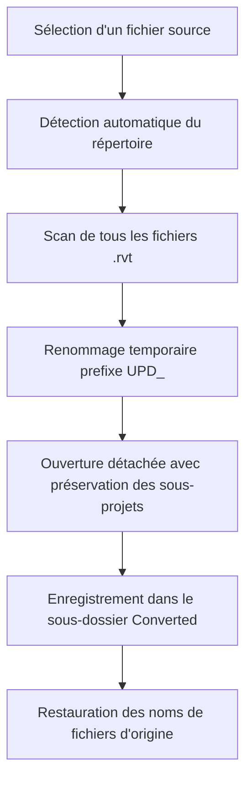

# Rapport des Fonctionnalités du Plugin UpgradeUpdateRvt

Ce rapport détaille les fonctionnalités métier et techniques du plugin Revit **UpgradeUpdateRvt**.

---

## 📂 Vue d'ensemble du Plugin
Le plugin se compose de deux outils distincts facilitant la maintenance des modèles Revit sur de grands projets :
1. **Mise à niveau automatisée (Upgrade) en lot** des fichiers Revit d'un dossier vers la version active du logiciel (Revit 2026).
2. **Gestion et actualisation automatisée des liaisons (Links)** (RVT et IFC) dans le modèle actif.

---

## ⚡ Fonctionnalité 1 : Mise à niveau en lot (Upgrade)

### 📌 Objectif
Permettre de migrer rapidement un ensemble de fichiers `.rvt` (ex: des fichiers reçus de partenaires dans des versions antérieures de Revit) vers la version actuelle du projet sans intervention manuelle répétitive.

### 🔄 Cycle de fonctionnement

### ⚙️ Caractéristiques techniques & Métier
* **Sélection ergonomique** : L'utilisateur sélectionne un seul fichier Revit témoin, et le plugin en déduit le dossier complet de travail.
* **Sélection du suffixe de sortie** : Permet de configurer un suffixe (ex: `_V2`) pour les fichiers convertis.
* **Automatisation silencieuse des tâches** :
  - Supprime tous les avertissements non bloquants (`DeleteAllWarnings`) pendant l'exécution.
  - Répond automatiquement aux boîtes de dialogue Revit (`Ok` / `Close` / `Cancel`) pour éviter le blocage de la tâche.
* **Préservation des structures collaboratives** :
  - Ouvre les modèles avec l'option `DetachAndPreserveWorksets` (détachés avec conservation des sous-projets).
  - Enregistre à nouveau les fichiers en tant que modèles centraux (`SaveAsCentral = true`) si le fichier d'origine était partagé (workshared).
* **Indicateur de progression** : Affiche une boîte de progression interactive avec possibilité d'annuler la conversion à tout moment.

> [!NOTE]
> **Note de Stabilisation** :
> Les fichiers de sauvegarde automatique de Revit (ex: `projet.0001.rvt`) sont désormais exclus automatiquement lors du chargement des fichiers pour la mise à niveau, tout comme pour la gestion des liens.

---

## 🔗 Fonctionnalité 2 : Gestionnaire de Liaisons (Revit Links & IFC)

### 📌 Objectif
Mettre à jour, recharger ou insérer en lot des fichiers liés dans le projet actif à partir d'un répertoire de référence.

### 🧠 Appariement Intelligent (Fuzzy Matching)
Le plugin intègre un algorithme basé sur la **distance de Levenshtein** (calcul de similarité de chaînes de caractères) :
- Il récupère les liens déjà existants dans le modèle actif.
- Il scanne le dossier sélectionné et calcule le taux de ressemblance entre le nom du fichier du disque et le nom du lien Revit.
- Si le taux est supérieur à **92%**, le plugin associe automatiquement le fichier au lien correspondant dans l'interface graphique.

### ⚙️ Caractéristiques techniques & Métier
* **Prise en charge native de deux formats** :
  - **Fichiers Revit (.rvt)** : Exclut automatiquement les fichiers de sauvegarde (`.0001.rvt`, etc.) et le modèle actif lui-même.
  - **Fichiers IFC (.ifc)** : Convertit automatiquement le fichier IFC en format Revit `.RVT` temporaire avant de l'ajouter en tant que liaison.
* **Mise à jour (Reload From)** : Si le lien est déjà présent dans le modèle, il met à jour son chemin (`LoadFrom`) vers le nouveau fichier du dossier.
* **Nouvelle liaison (Insert Link)** : Si le fichier n'a pas de correspondance existante dans le modèle :
  - Le plugin l'insère.
  - Il aligne le point de base du lien sur le point de base du projet hôte (`MoveBasePointToHostBasePoint(true)`).
* **Contrôle précis** : L'utilisateur choisit explicitement quels fichiers lier et charger via des cases à cocher dans la liste.
